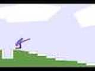
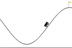
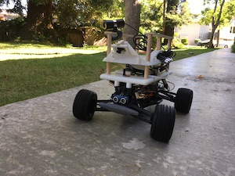
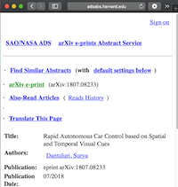
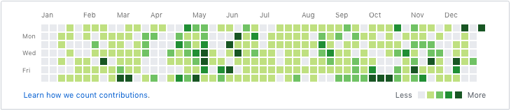
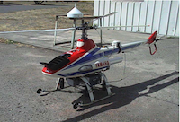
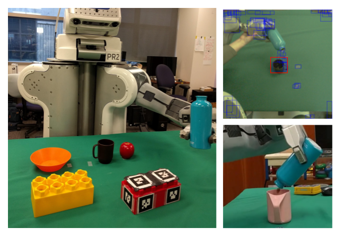
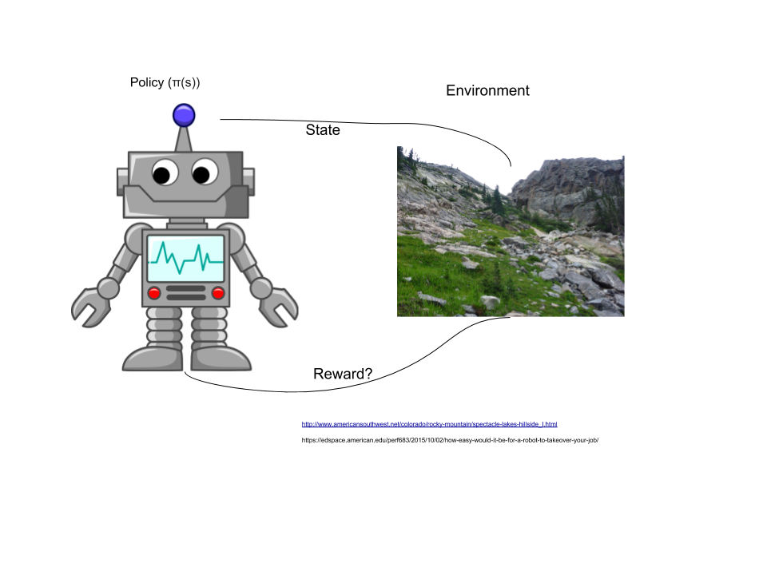

title: Reinforcement Learning
author:
  name: Surya Dantuluri
  twitter: notsuryad
  url: https://suryad.com
output: basic.html
controls: true

--
# Reinforcement Learning
## An peek at what RL is and its capabilities

--
### About me

#### High Schooler from the Bay Area (Silicon Valley)

--

### Background of RL

* Came from psychology of animal learning (trial and error)
* Richard Bellman was the original creator of the Bellman Equation (essential for Dynamic Programming, 1957)
* John Holland introduced classifer systems (true RL, 1975)

#### Read Andrew Ng's thesis (bit.ly/andrewngthesis)

[comment]: <> (Dynamic programming is widely considered the only feasible way of solving general stochastic optimal control problems.  It suffers from what Bellman called "the curse of dimensionality," meaning that its computational requirements grow exponentially with the number of state variables, but better than anything else.)

[comment]: <> (Instead of trying to produce
a
program to simulate the adult
mind, why not rather try to
produce one which simulates the
child's? If this were then subjected
to an appropriate course of
education one would obtain the
adult brain
.)

--

### Uses of RL

* Self driving cars
* Youtube
* Alpha Go
* Primarily Robotics

[comment]: <> (Beating Go champions:
Supervised learning + policy
gradients + value functions +
Monte Carlo tree search:)

--

### Some RL Theory

